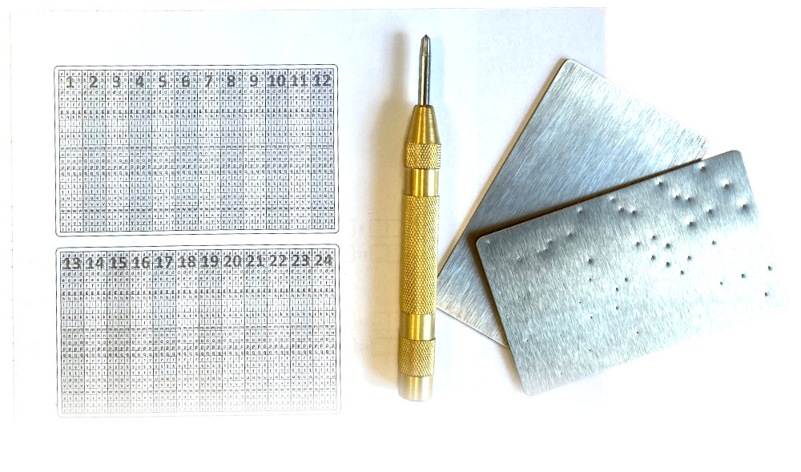

# DIYseed.core .NET library

.NET library to generate stencils for cryptocurrency-wallet seed backup.

Online version at [DIYseed.net](https://diyseed.net/)

The solution is inspired by commercial seed backup solutions (Seedplate, Steelplate, and many others...).

# How it works

## Create seed backup

The library generates a PDF containing a "table" to store your seed. You just print it and check your seed words as you see on animation.

When it is complete, you can stick it on a metal sheet (metal card) and punch each character over the paper to the metal.

When it is done, remove the paper. You have durable seed backup.

- **specify seed properties** - generate stencil for any length of the seed
- **specify metal card properties** - generate stencil for any size of metal card

## Read seed backup

To read seed backup cards, you can print writing stencil to transparent paper and overlay the card.

If you can't print to transparent paper, you can use the generated reader, which is part of the generated PDF.

The principle is shown below. Just cut the red line on the paper, insert the backup card and move it character by character.

# Motivation
To have seed words backup just on a piece of paper is not a good idea. Not just because paper can be destroyed by things like fire, water, UV radiation, etc. You can also more easily lose it than a piece of a proper metal item.

There are many solutions for creating a secure backup of the seed words. But they are just overpriced pieces of metal. Especially if you are willing to create more backup tokens (for example because of Shamir backup...).

We wanted to create a solution for durable metal seed backup with those thoughts in mind:
- **Durability** - seed backup is as durable as commercial ones
- **It is cheap** - you do not need any special tools to create the backup
- **Variability** - it can store seeds of any length
- **Easy to use** - it is easy to create a backup for everyone as well as read it

# Theory about a seed
I suppose everyone who is here understands, what does seed is. But for our backup is important to know these facts:

1. **seed is composed of a few (usually 12 or 24) words**
2. **each word is determined by its first 4 characters**
   -  It is enough to know only the first four letters from each word to recover your seed. So backup stores only the first 4 words. HW wallets like Ledger and Trezor will fill the rest of the word during recovery.
3. **each word represent one number (0-2047)**
   -  You can store those numbers instead of words. (a backup can fit on smaller metal card)

# How you can create your backup?

The best way is to explain by example. Imagine, you have the metal card (plate, sheet) of size 100x60mm and you want to create seed backup.

1. Use generator [DIYseed.net](https://diyseed.net/) and fill properties of the card and seed. You will get PDF with a stencil the same size as your card, prepared to store your seed.

2. Check your seed words to the writing stencil. The writing stencil is a simple table. The **Y-axis** represents alphabet characters. The **X-axis** represents words of seed. Each word is made by 4 characters ([Read theory about a seed](#theory-about-a-seed)).

3. Attach stencil on the metal card (use glue or tape) and punch a dent by center punch tool over the paper. 

That's it, backup is complete. In the end, you can remove the stencil and destroy it. Seed backup without stencil is readable "just by sight" (but do not rely on that - if you have a photo of a card, for example, you can read it just with a little work).

In the picture below, you can see how to store seed with leading words **bike**, **acid**, **key**, **satoshi** and how does it look like after you will remove the stencil.

# How can you read back your seed?

## option 1
Use writing stencil, printed on transparent paper. Just overlay the metal backup and you will see, what letter each dent represents.

## option 2
Another solution is to use our reader, which will be generated along with the writer. The principle is shown on the gif at the beginning.

# The .NET stencils generator solution
The solution contains 2 projects:
- **Diyseed.Core** - class library containing PDF generator
- **Diyseed.App** - sample console app to demonstrate the generator

## Parameters of Diyseed.Core generator

- **Card size** - the size of the card in mm
- **Card count** - number of cards to split seed over[See sample #1 - 2 cards split](samples/sample1.pdf)
- **Seed length** - number of words of the seed (12, 24, 33...)
- **Card split** - Number of rows per card (if you have a bigger card, you can store more rows of words per card. [See sample #2](samples/sample2.pdf)
- **Card encoding** - You can store each word either represented by alphabet or as a number. [See sample #3](samples/sample3.pdf)
- **Copies** - Number of copies of the stencil
- **Sections** - You can choose what is par of generated PDF. Reader, writer, and manual.
- **Manual PDF** - PDF with manual, appended to end of the generated document

## Use of the sample console app

## Sample PDF files
- [Sample #1 (24 words seed, 2 cards, size 100x60mm)](samples/sample1.pdf)
- [Sample #2 (24 words seed, 1 card, size 100x100mm, 2 rows split)](samples/sample2.pdf)
- [Sample #3 (12 words seed, 4 cards, size 20x20mm, numbers encoding)](samples/sample3.pdf)

### To-Do
- [x] Possibility to generate multiple sets of writing stencils
- [ ] Add top-left corner marker to stencils (dent to the edge, represents top left corner and number of the card)
- [ ] Add how-to videos
- [ ] Write generator parameters to the stencils

# FAQ

## Are just 4 characters from each word enough to recovery seed?
Yes, 4 each from 2048 words is determined by its leading 4 characters. You can check yourself, there is not any pair of words, in whole [BIP 39 wordlist](https://github.com/bitcoin/bips/blob/master/bip-0039/bip-0039-wordlists.md)

## Can I recover the seed without your stencils/readers?
If you will not be able to print the reading stencil for any reason, you can always write the table/mesh by yourself.

## How can I recognize the orientation of the card?
You can somehow mark the top-left corner of the card. For example, punch a dent on the top-left corner. It is on our roadmap to add it to stencils in the future.
