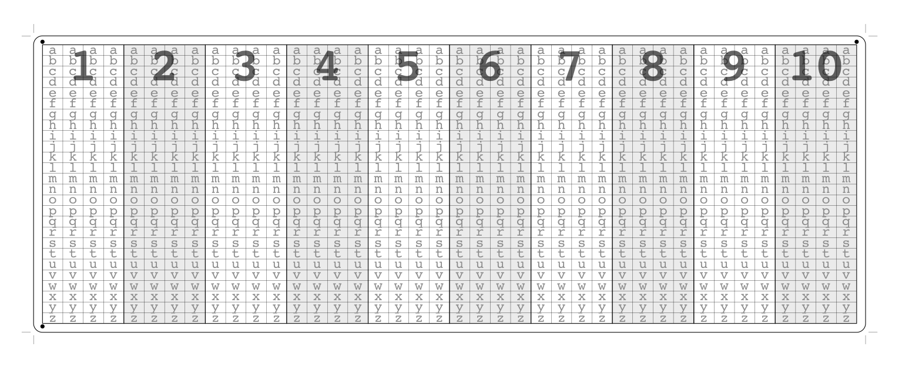
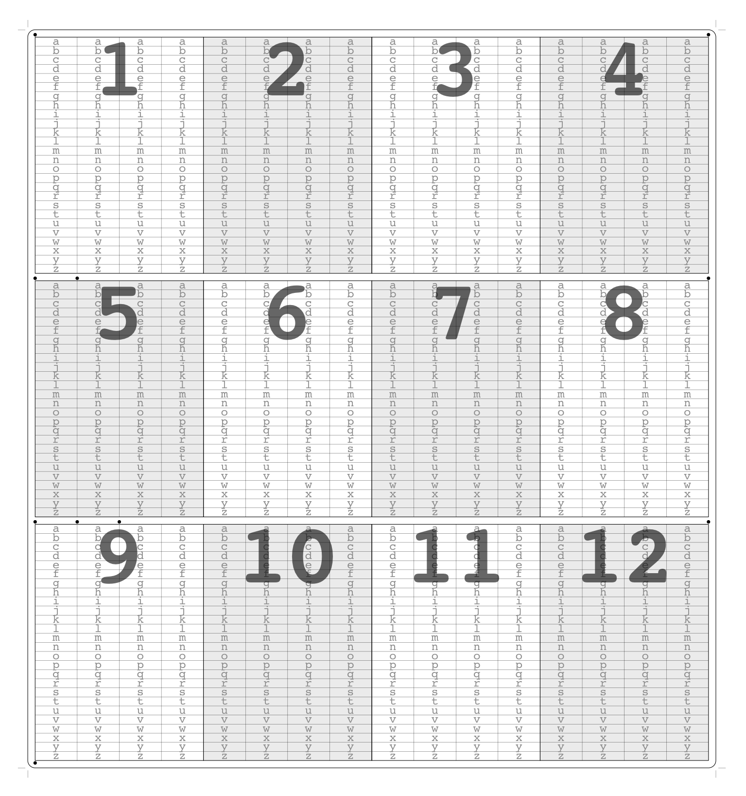
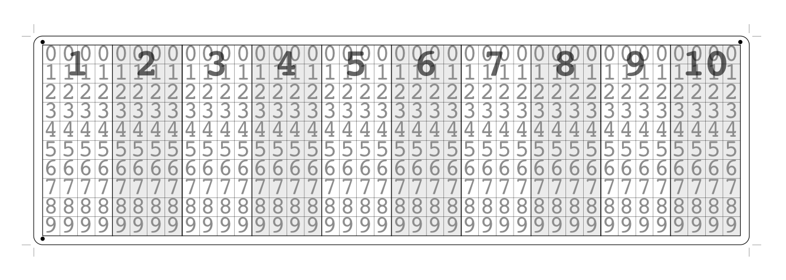
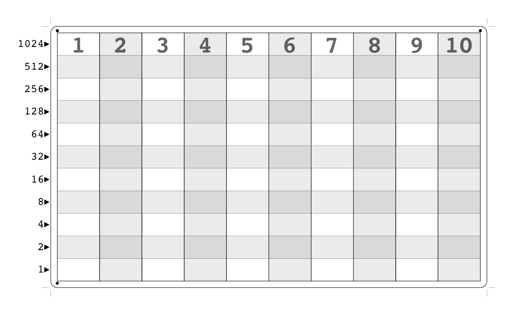
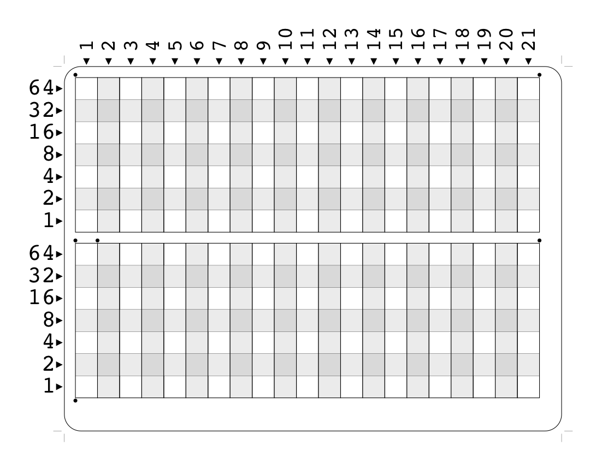

# DIYseed crypto wallet seed store tool

A web tool to generate stencils for BIP-39 cryptocurrency-wallet seed backup.

Online version at [HoboHodl.com](https://hobohodl.com/) (formerly diyseed.net).


The solution is inspired by commercial seed backup solutions (Seedplate, Steelplate, and many others...).

## Motivation

To have a seed words backup just on a piece of paper is not a good idea. Not just because paper can be destroyed by things like fire, water, UV radiation, etc. You can also more easily lose it than a piece of a proper metal item.

There are many solutions for creating a secure backup of the seed words. But they are just overpriced pieces of metal. Especially if you are willing to create more backup tokens (for example because of Shamir backup...).

We wanted to create a solution for durable metal seed backup with those thoughts in mind:
- **Durability** - seed backup is as durable as commercial ones
- **It is cheap** - you do not need any special tools to create the backup
- **Variability** - it can store seeds of any length, and can be punched into pretty much anything: an old credit card, a metal sheet, even wood
- **Easy to use** - it is easy to create a backup for everyone as well as read it
- **Stealth** - commercial backup plates are branded, boxed, and obviously "crypto backup hardware." A card you punch yourself doesn't have to look like anything

Buying a commercial backup plate also means giving a company your name and shipping address, and that data doesn't always stay safe. Ledger's [2020 breach](https://www.ledger.com/addressing-the-july-2020-e-commerce-and-marketing-data-breach) exposed roughly 270,000 customers' names, addresses, and phone numbers. Trezor's [breach this month](https://www.coindesk.com/tech/2026/08/13/trezor-warns-14-000-users-after-fulfilment-partner-suffers-data-breach) exposed shipping details for another ~14,000. It's not just wallet vendors either: Coinbase's [2025 insider breach](https://www.bleepingcomputer.com/news/security/coinbase-discloses-breach-faces-up-to-400-million-in-losses/) shows exchanges leak the same kind of data too, and it gets sold for targeted extortion. Generating your own stencil in the browser means none of that data ever has to exist in the first place.

## How it works

- **specify seed properties** - generate stencil for any length of the seed
- **specify metal card properties** - generate stencil for any size of metal card

### Creating a backup

The tool generates a PDF containing a "mesh" to store your seed. You just print it and check off your seed's characters as shown in the animation below.


The best way to explain the rest is by example. Imagine you have a metal card (plate, sheet) of size 100x60mm and want to create a seed backup:

1. Use the generator at [HoboHodl.com](https://hobohodl.com/) and fill in the properties of the card and seed. You will get a PDF with a stencil the same size as your card, prepared to store your seed.

2. Mark your seed words onto the writing stencil. The writing stencil is a simple mesh. The **Y-axis** represents alphabet characters. The **X-axis** represents words of the seed. Each word is marked by its first 4 characters ([read theory about a seed](#theory-what-is-a-seed)). Other encodings and orientations are available too, under **Advanced options** in the form. See [Parameters](#parameters) for the full list.

3. Attach the stencil to the metal card (use glue or tape) and punch a dent with a center punch tool over the paper, at every marked position, including the corner marks (see below).

Every card also gets small corner marks punched along with the mesh: the **top-left** corner carries a row of dots, as many dots as the card's number in the sequence, while the **top-right** and **bottom-left** corners each get a single dot. Punch those too. Once the stencil is removed, they're what let you find each card's top-left corner again and tell the cards apart, even after they're unstacked and out of order.

That's it, the backup is complete. In the end, you can remove the stencil and destroy it. A seed backup without its stencil is not readable "just by sight" (but do not rely on that - if someone has a photo of the card, for example, it can be read back with a little work).

In the picture below, you can see how to store a seed with leading words **bike**, **acid**, **key**, **satoshi**, and what it looks like after the stencil is removed.


### Reading a backup

To read a backup card, print the writing stencil onto transparent paper and overlay it on the card. Each dent lines up with the letter (or digit) it represents. Use the corner marks (see [Creating a backup](#creating-a-backup)) to line the stencil up the right way round and identify which card you're holding. Only the top-left corner carries more than one dot, so that's always the corner to align first.

If you can't print on transparent paper, check **Include reader** under Advanced options when generating your stencil. It adds a printable, non-transparent reader page: cut along the red dashed line, align the guidelines flush with your card's mesh, and slide it to read off letters/digits (or bit place-values, for Binary and Passphrase) one word or character at a time, using the fill-in boxes to build up the recovered seed/passphrase as you go. The principle is shown below.


## Theory: what is a seed

We suppose everyone who is here understands what a seed is. But for our backup, it's important to know these facts:

1. **A seed is, at its core, one big number.** Your wallet derives every key and address it ever generates from it.
2. **That number can just as well be split into several smaller numbers.** [BIP-39](https://github.com/bitcoin/bips/blob/master/bip-0039/bip-0039.mediawiki) does exactly this: it slices the seed's entropy (+ a checksum) into a sequence of 11-bit chunks, each a number from 0 to 2047.
3. **Each of those numbers is substituted with a word, purely for readability.** Which word stands for which number is fixed by the [BIP-39 wordlist](https://github.com/bitcoin/bips/blob/master/bip-0039/bip-0039-wordlists.md). That's why a seed is "a few words" (usually 12 or 24) rather than "a few numbers" to begin with.
4. **Each word is uniquely determined by its first 4 characters.**
   - It is enough to know only the first four letters of each word to recover your seed, so the backup stores only those. HW wallets like Ledger and Trezor will fill in the rest of the word during recovery.

So it makes no real difference whether you store the one big number, the several smaller numbers, the words, or just each word's first 4 characters. They're all just different representations of the same seed. In practice, most hardware wallets work with words, so storing whole words (or their 4-character prefixes) is the most convenient: that's the **Alphabet** encoding. Storing the raw numbers as bits instead is more compact and fits smaller cards: that's the **Binary** encoding (see [Parameters](#parameters)).

## Using the generator

A client-side TypeScript web app. No install, no server, no account. Open
the page, fill in your card and seed parameters, and it generates the
stencil PDF entirely in your browser.

### Parameters

All ranges below are enforced by the generator itself (`GeneratorParameters` /
`PassphraseParameters` throw a `RangeError` outside them); the form additionally
validates against the same ranges before it will submit.

#### Seed stencil

| Parameter | Range | Default | Notes |
|---|---|---|---|
| Seed length (words) | 10 – 39 | 12 | See [do the ranges make sense?](#do-the-ranges-make-sense) below. Standard BIP-39 seeds are 12/15/18/21/24 words; the wider range exists to support non-standard/split (e.g. Shamir) backups. |
| Card count | 1 – 13 | 1 | How many physical cards the seed's words are spread across. In practice, 6 or fewer (3 two-sided physical cards) is about as many as stays manageable to punch, store, and reassemble. See [do the ranges make sense?](#do-the-ranges-make-sense). |
| Card width / height | 20 – 180 mm | 85.6 × 54 mm | Default matches a credit card (ISO/IEC 7810 ID-1). Upper bound is fixed by the A4 page minus margins. |
| Card split | 1 – 5 | 1 | Word-rows per card, for taller cards. Not user-facing for Binary encoding, since it's computed automatically. |
| Card padding | 1 – 5 mm | 1.5 mm | Blank border inside each card, outside the punch mesh. |
| Card corner radius | 0 – 5 mm | 1.5 mm | Not currently exposed in the form; always uses the default. |
| Encoding | Alphabet / Binary | Alphabet | Alphabet punches each word as its 4-letter prefix; Binary punches its BIP-39 index (0–2047) as bits. |
| Copies | 1 – 10 | 1 | Number of complete stencil sets to generate in one PDF. |

#### Passphrase stencil (optional, in addition to or instead of the seed)

| Parameter | Range | Default | Notes |
|---|---|---|---|
| Enabled | on / off | off | At least one of Seed or Passphrase must be enabled. |
| Card count | 1 – 13 | 1 | Model supports more, but the form currently only ever generates 1 card. |
| Cell size override | 1 – 10 mm | none (inherits) | When unset, reuses the seed's computed cell size so both stencils punch at the same pitch; if the seed is disabled, falls back to 2 mm. |

Card size and padding are shared between the seed and passphrase stencils
(there's only one set of card-size/padding fields in the form).

#### Examples

Sample stencils generated by the tool, one per encoding/layout combination (cropped to just the card; corner marks and, where applicable, the row/column headers are visible).

**Alphabet, single line** — each cell holds a letter; the four cells under each word number are punched to mark that word's 4-letter prefix.



**Alphabet, split across 3 lines (Card split = 3)** — each line is one section of the card, with a padding-sized gap between sections so the lines stay visually distinct.



**Number encoding** — same layout as Alphabet, with digit rows (0–9) instead of letters.



**Binary encoding** — each word is a column of 11 bits (values 1–1024, shown at left) punched to encode its BIP-39 index (0–2047) directly, rather than a printed character.



**Passphrase stencil** — one block per passphrase (here 2, stacked with the same gap logic as multi-line seeds), each column a character position and each row a bit place-value.



#### Do the ranges make sense?

A few of the above are soft engineering limits rather than physical/real-world
ones, worth calling out if you're changing the code or picking unusual values:

- **Seed length (10–39 words).** A real BIP-39 seed is always 12, 15, 18, 21,
  or 24 words (each length maps to a fixed entropy+checksum size). The
  generator deliberately allows other lengths too, since it's also used for
  non-standard cases (partial backups, Shamir/SLIP-39 shares, passphrases
  entered as "words"), but if you're backing up a plain BIP-39 seed, only
  those five lengths correspond to anything a wallet will actually recognize.
- **Cell size floor.** The hard minimum for a punch cell is enforced
  indirectly (padding/card-size ranges keep it positive), except for the
  passphrase cell-size override, which has an explicit 1 mm floor
  (`PASSPHRASE_OVERRIDE_CELL_SIZE_RANGE`). Below ~1.5 mm a center punch
  generally can't produce distinguishable dents on metal, so the UI shows a
  "cell too small" warning (`MIN_CELL_SIZE_MM`) starting at 1.5 mm even though
  values down to 1 mm are technically accepted. Treat 1–1.5 mm cells as
  "generates, but probably not punchable" rather than a safe range.
- **Cell aspect ratio.** Cells more elongated than 2:1
  (`MAX_CELL_ASPECT_RATIO`) trigger a "not square" warning. Very oblong cells
  make the punched dent's row/column ambiguous to read back.
- **Card size (20–180 mm).** The floor is arbitrary (a card smaller than
  ~20 mm can't fit a usable mesh). The ceiling is a real physical constraint:
  it's exactly what fits on an A4 page inside the document margins, since each
  card renders as one stencil on one page.
- **Card corner radius / padding (0–5 mm / 1–5 mm).** These are cosmetic
  layout bounds (how rounded the corners look, how much blank border
  surrounds the mesh) rather than anything with a physical limit. Pick
  values based on your card's own shape.
- **Card count (1–13).** Each card in that range corresponds to one side of
  a physical card (see the [corner marks](#creating-a-backup): cards 1/2
  share a physical card as sides A/B, 3/4 the next one, and so on). 13 sides
  is technically allowed, but keeping track of, punching, and reassembling
  more than ~6 sides (3 double-sided cards) in the right order gets
  unwieldy fast. Treat the practical ceiling as lower than the enforced one.

If you need values outside these ranges, they live in
`src/generator/config.ts` (`*_RANGE` / `*_DEFAULT` constants).

### Running locally
```
npm install
npm run dev
```

### Building for deployment
```
npm run build
```

Outputs a static site to `dist/`, deployable to any static host.

### To-Do
- [ ] Port the Manual PDF section to the JS app

## FAQ

### Are just 4 characters from each word enough to recover the seed?
Yes, each of the 2048 words in the [BIP-39 wordlist](https://github.com/bitcoin/bips/blob/master/bip-0039/bip-0039-wordlists.md) is uniquely determined by its leading 4 characters. You can check yourself: there's no pair of words in the list that share their first four letters.

### Can I recover the seed without your stencils/readers?
If you're not able to print the reading stencil for any reason, you can always draw the mesh by hand yourself.

### How can I recognize the orientation of the card?
Every stencil already includes corner marks for this. Punch them along with the mesh. The top-left corner gets a row of dots (as many as the card's number), while the top-right and bottom-left corners each get a single dot. Since only the top-left corner ever has more than one dot, you can always find the correct orientation and card number later, even after the cards are unstacked.

## Release notes

### v2
- Added more ways to encode the seed, useful for smaller backups: a Binary encoding option alongside the existing Alphabet encoding.
- Added an option to generate a backup stencil for a passphrase, in addition to the seed.
- Switched from a .NET console app to a JavaScript app that runs in any browser. Rendering happens entirely client-side, so you can save the page and use it offline.
- Renamed the project from diyseed.net to HoboHodl.com.
